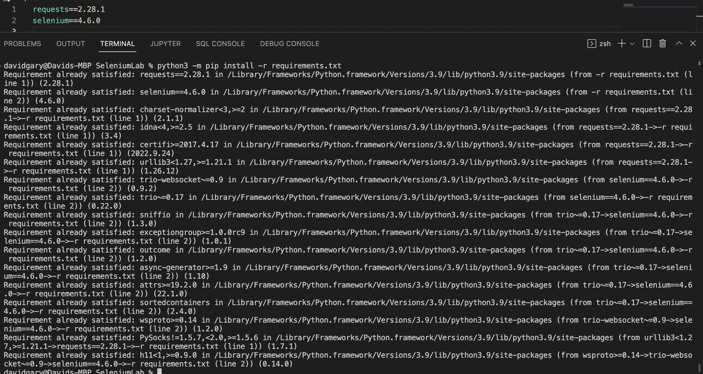
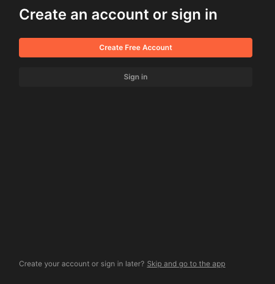
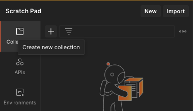
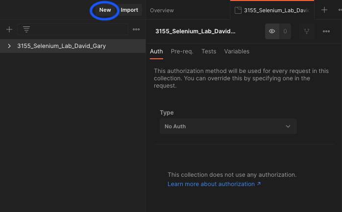
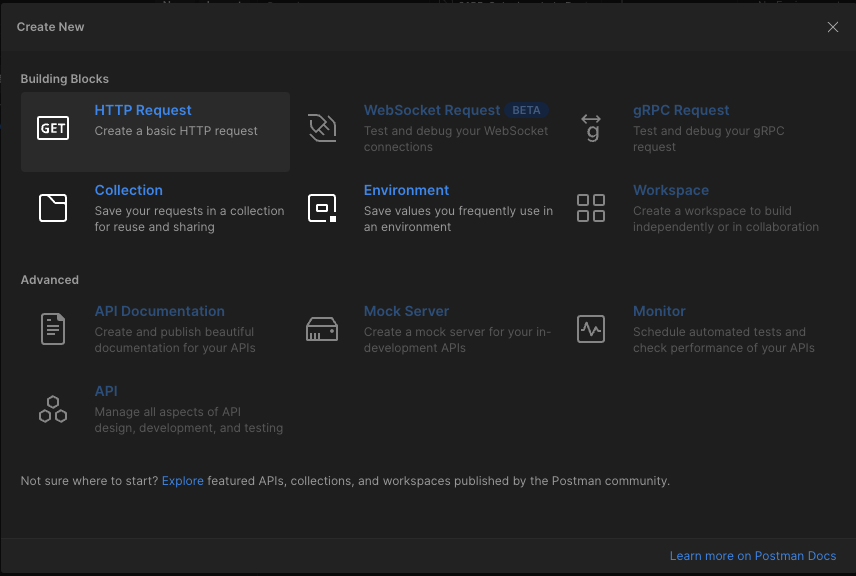
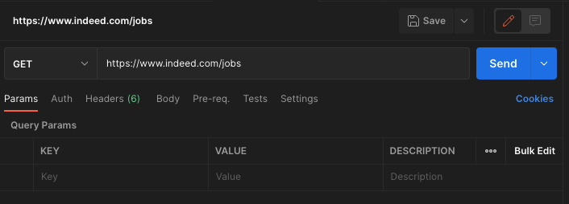
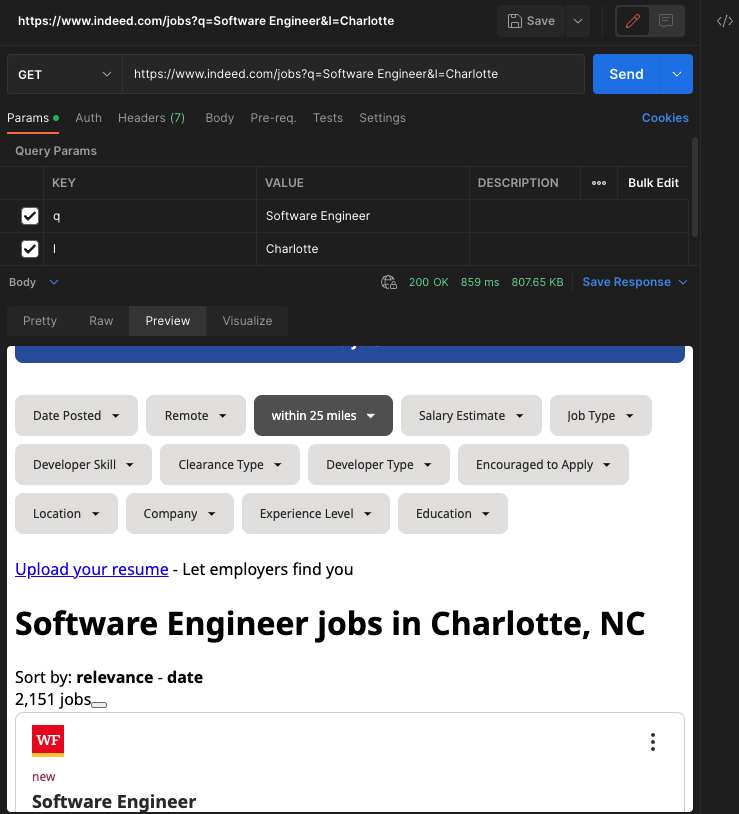
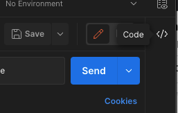

# Web Scraping with Selenium in Python

## Description

In this lab, we will be using the application [Postman](https://www.postman.com/downloads/) to better understand the HTTP requests being made to the server. Postman is a tool that allows you to make HTTP requests to a server and see the response. It is a great tool for debugging and testing APIs. We will also set up the basic tools you need to start web scraping with Selenium.

## Task 1: Installations

- Download and install Postman from [here](https://www.postman.com/downloads/).
- Download the [ChromeDriver](https://chromedriver.chromium.org/downloads) for your operating system and the current version of Chrome (you can check your Chrome version by going to `chrome://settings/help` in your browser).
  - **Note**: You will need to unzip the file after downloading it.
- Place the ChromeDriver in the `chromedriver` folder in this lab.
- Run the following command in your terminal to install the necessary packages for this lab:
  - `python -m pip install -r requirements.txt`
  - Remember that your machine may require a different keyword to run this. Whichever keyword you have used to run `pip` up until this point should be the one you use here.
- Screenshot your terminal after running the requirements installation command and save it for submission.
  - example:
    - 
  
## Task 2: Create New Collections and Requests in Postman

- Open the Postman application
  - **Note**: You do not need to create an account. Select the "Skip getting started" option at the bottom of the page.
  - 
- Select the "Create new collection" option in the left sidebar, and name it "3155_Selenium_Lab_Your_Name".
  - **Note**: Replace "Your_Name" with your actual name.
  - 

- Click the "New" button in the top left corner of the Postman window.
  - 
- Select the "HTTP Request" option.
  - 
- Enter "https://www.indeed.com/jobs" in the "Enter request URL" field and set it as a GET request.
  - 
- Add two key value pairs to the "Params" section of the request:
  - `q` with the value `Software Engineer`
  - `l` with the value `Charlotte`
- Click the "Send" button to send the request.
- Preview the response in the "Preview" tab, screenshot this, and save it for submission later in the lab.
  - 
- Import this as Python code using the `requests` library by clicking the "Code" button in the right sidebar and selecting "Python - requests" from the dropdown menu.
  - 
- Copy the code and paste it into the `raw_request.py` file in this lab.

## Task 3: Introduction to `requests` and `selenium`

- Run the `raw_request.py` file to see the response, screenshot this, and save it for submission later in the lab.
- Run the `selenium_starter.py` file to see the response, screenshot this, and save it for submission later in the lab.
  
## Submission

- On Canvas, submit the screenshots of your terminal after running the requirements installation command, the Postman response, the `raw_request.py` response, and the `selenium_starter.py` response.
